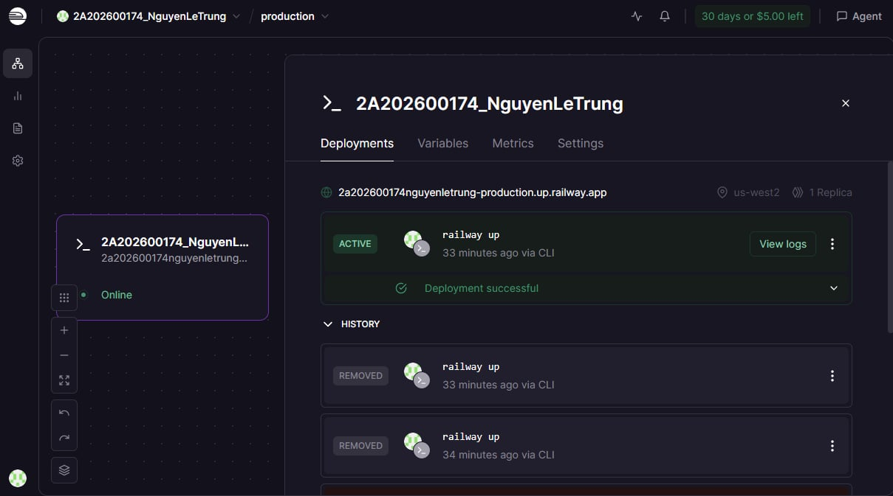

# Deployment Information

> **Student Name:** Nguyễn Lê Trung  
> **Student ID:** 2A202600174  
> **Date:** 17/4/2026

---

## Public URL

```
https://2a202600174nguyenletrung-production.up.railway.app
```

## Platform

**Railway** — deployed via Railway CLI (`railway up`)

---

## Environment Variables Set (Railway)

| Variable | Value |
|----------|-------|
| `PORT` | Set by Railway automatically |
| `ENVIRONMENT` | `production` |
| `AGENT_API_KEY` | `secret-key-123` *(change in real deployment)* |
| `JWT_SECRET` | `prod-jwt-secret-2026` |
| `OPENAI_API_KEY` ||
| `LLM_MODEL` | `gpt-4o-mini` |
| `RATE_LIMIT_PER_MINUTE` | `3` |
| `MONTHLY_BUDGET_USD` | `10.0` |

> **Note:** `REDIS_URL` chưa được set trên Railway (không có Redis add-on) — app dùng in-memory storage. Để stateless thật sự, cần thêm Redis add-on trong Railway dashboard.

---

## Test Commands

### Health Check
```bash
curl https://2a202600174nguyenletrung-production.up.railway.app/health
# Expected: {"status":"ok","version":"1.0.0","environment":"production","uptime_seconds":...,"checks":{"llm":"openai","storage":"in-memory"},...}
```

### Root Info
```bash
curl https://2a202600174nguyenletrung-production.up.railway.app/
# Expected: {"app":"Production AI Agent","version":"1.0.0","environment":"production","endpoints":{...}}
```

### Readiness Check
```bash
curl https://2a202600174nguyenletrung-production.up.railway.app/ready
# Expected: {"ready":true,"storage":"in-memory"}
```

### Authentication Required (401 without key)
```bash
curl -X POST https://2a202600174nguyenletrung-production.up.railway.app/ask \
  -H "Content-Type: application/json" \
  -d '{"question": "Hello"}'
# Expected: 401 {"detail":"Missing API key. Include header: X-API-Key: <key>"}
```

### API Test (with authentication)
```bash
curl -X POST https://2a202600174nguyenletrung-production.up.railway.app/ask \
  -H "X-API-Key: secret-key-123" \
  -H "Content-Type: application/json" \
  -d '{"question": "What is Docker?"}'
# Expected: 200 {"question":"What is Docker?","answer":"...","model":"gpt-4o-mini","session_id":"...","turn":1,"storage":"in-memory","timestamp":"..."}
```

### Conversation History (session continuity)
```bash
# Lần 1 — bắt đầu session
SESSION=$(curl -s -X POST https://2a202600174nguyenletrung-production.up.railway.app/ask \
  -H "X-API-Key: secret-key-123" \
  -H "Content-Type: application/json" \
  -d '{"question": "My name is Alice"}' | jq -r '.session_id')

# Lần 2 — tiếp tục session
curl -X POST https://2a202600174nguyenletrung-production.up.railway.app/ask \
  -H "X-API-Key: secret-key-123" \
  -H "Content-Type: application/json" \
  -d "{\"question\": \"What is my name?\", \"session_id\": \"$SESSION\"}"
# Expected: turn=2, agent nhớ tên Alice
```

### Rate Limiting Test (429 after 3 req/min)
```bash
for i in {1..5}; do
  echo -n "Request $i: "
  curl -s -o /dev/null -w "%{http_code}" \
    -X POST https://2a202600174nguyenletrung-production.up.railway.app/ask \
    -H "X-API-Key: secret-key-123" \
    -H "Content-Type: application/json" \
    -d '{"question": "test"}'
  echo ""
done
# Expected: 200 x3, sau đó 429
```

### Chat UI
```
https://2a202600174nguyenletrung-production.up.railway.app/ui
```
Giao diện chat + panel test nhanh (health, auth, rate limit, metrics).

### Metrics (authenticated)
```bash
curl https://2a202600174nguyenletrung-production.up.railway.app/metrics \
  -H "X-API-Key: secret-key-123"
# Expected: {"uptime_seconds":...,"total_requests":...,"error_count":...,"monthly_spend_usd":...}
```

---

## Local Development

### Run with Docker Compose (3 agents + Redis + Nginx)
```bash
cd 06-lab-complete
cp .env.local .env   # copy env file (edit OPENAI_API_KEY if needed)
docker compose up --build --scale agent=3 -d

# Test via nginx (port 80)
curl http://localhost/health
curl -X POST http://localhost/ask \
  -H "X-API-Key: secret-key-123" \
  -H "Content-Type: application/json" \
  -d '{"question": "Hello"}'

# Xem logs
docker compose logs -f agent

# Dừng
docker compose down
```

### Run locally (without Docker)
```bash
cd 06-lab-complete
pip install -r requirements.txt
cp .env.local .env
python -m app.main
# hoặc
uvicorn app.main:app --host 0.0.0.0 --port 8000 --reload
```

---

## Architecture

```
[Client]
    |
    | HTTPS
    v
[Railway Platform]
    |
    v
[uvicorn — app.main:app]  ← PORT từ Railway env
    |
    +-- GET  /health        (liveness probe)
    +-- GET  /ready         (readiness probe)
    +-- POST /ask           (AI agent — X-API-Key required)
    +-- GET  /chat/{id}/history
    +-- GET  /metrics
    |
    +-- LLM: OpenAI gpt-4o-mini  (khi OPENAI_API_KEY set)
    +-- Storage: in-memory (Railway) / Redis (local Docker)
```

---

## Screenshots


---

## Deployment Steps (Railway CLI)

```bash
# 1. Install Railway CLI
npm i -g @railway/cli

# 2. Login
railway login

# 3. Link project
railway link

# 4. Set environment variables
railway variables set ENVIRONMENT=production
railway variables set AGENT_API_KEY=your-secret-key
railway variables set JWT_SECRET=your-jwt-secret
railway variables set OPENAI_API_KEY=sk-...
railway variables set LLM_MODEL=gpt-4o-mini
railway variables set RATE_LIMIT_PER_MINUTE=3
railway variables set MONTHLY_BUDGET_USD=10.0

# 5. Deploy
cd 06-lab-complete
railway up --detach

# 6. Get URL
railway domain
```
