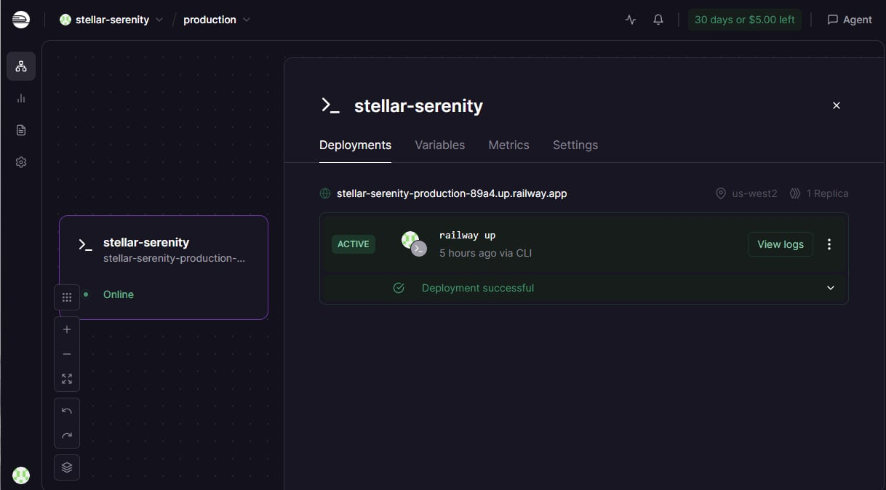

# Day 12 Lab - Mission Answers

> **Student Name:** Nguyễn Lê Trung  
> **Student ID:** 2A202600174  
> **Date:** 17/4/2026

---

## Part 1: Localhost vs Production

### Exercise 1.1: Anti-patterns found (in `01-localhost-vs-production/develop/app.py`)

1. **API key hardcoded** — `OPENAI_API_KEY = "sk-hardcoded-fake-key-never-do-this"` và `DATABASE_URL` chứa password — nếu push lên GitHub key bị lộ ngay lập tức.
2. **DEBUG = True hardcoded** — debug mode không nên bật trên production vì lộ stack trace và giảm performance.
3. **`print()` thay vì proper logging** — kể cả log ra secret (`OPENAI_API_KEY`) — không thể filter/search/parse sau này.
4. **Không có health check endpoint** — nếu app crash, platform (Railway/Render/K8s) không biết để restart.
5. **Port cứng và host = "localhost"** — `uvicorn.run(host="localhost", port=8000)` chỉ nghe trên loopback, không nhận request từ bên ngoài container; không đọc `$PORT` từ env.
6. **Không có graceful shutdown** — process bị kill đột ngột, request đang xử lý bị mất.

### Exercise 1.3: Comparison table

| Feature | Develop (Basic) | Production (Advanced) | Tại sao quan trọng? |
|---------|-----------------|----------------------|---------------------|
| Config | Hardcode trong code (`OPENAI_API_KEY = "sk-..."`) | Env vars qua `pydantic-settings` / `.env` | Không lộ secret trong source code; dễ đổi cấu hình giữa local, staging, production mà không sửa code |
| Health check | Không có | `GET /health` (liveness) + `GET /ready` (readiness) | Cloud platform/load balancer biết app còn sống và sẵn sàng nhận request; tự restart hoặc ngừng route traffic nếu fail |
| Logging | `print()` + log ra secret | JSON structured logging (`{"ts":..,"lvl":..,"msg":..}`) | Log dạng JSON dễ search, filter, parse bằng Datadog/Loki/Cloud Logs; tránh log secret |
| Shutdown | Đột ngột — không handle SIGTERM | Graceful shutdown: `signal.signal(SIGTERM, handler)` + uvicorn `timeout_graceful_shutdown` | Khi platform tắt/redeploy, app hoàn tất request đang chạy và cleanup tài nguyên, tránh mất request |

---

## Part 2: Docker

### Exercise 2.1: Dockerfile questions (`02-docker/develop/Dockerfile`)

1. **Base image là gì?**  
   `python:3.11-slim` — image Python 3.11 phiên bản slim (không có dev tools thừa), dung lượng nhỏ hơn `python:3.11` đầy đủ.

2. **Working directory là gì?**  
   `WORKDIR /app` — tất cả lệnh `COPY`, `RUN`, `CMD` sau đó đều chạy trong `/app` bên trong container.

3. **Tại sao COPY requirements.txt trước?**  
   Để tận dụng Docker layer cache. Dependencies ít thay đổi hơn code. Nếu chỉ sửa `app.py`, Docker không cần chạy lại `pip install` vì layer đó vẫn được cache. Ngược lại, nếu copy toàn bộ source trước, chỉ cần sửa một dòng code cũng invalidate cache và phải cài lại toàn bộ packages.

4. **CMD vs ENTRYPOINT khác nhau thế nào?**  
   `CMD` là lệnh mặc định khi container start — dễ bị override: `docker run my-agent bash` sẽ chạy `bash` thay cho CMD.  
   `ENTRYPOINT` là lệnh cố định của container — khó override hơn, thường dùng khi image được thiết kế để luôn chạy một chương trình cụ thể.  
   Kết hợp `ENTRYPOINT ["python"] CMD ["app.py"]` thì `docker run my-agent script.py` sẽ chạy `python script.py`.

### Exercise 2.3: Image size comparison

- **Develop (single-stage):** ~424 MB (DISK: ~1.66 GB với cache)
- **Production (multi-stage):** ~56.6 MB (DISK: ~236 MB)
- **Giảm:** ~87%

**Stage 1 (builder) làm gì?**  
Cài toàn bộ dependencies vào virtualenv `/venv` (có `gcc` để compile native packages). Không phải image cuối.

**Stage 2 (runtime) làm gì?**  
Image nhỏ gọn, non-root user `agent`, chỉ copy `/venv` từ builder và application code. Không có compiler/build tools.

**Tại sao image nhỏ hơn?**  
Multi-stage build loại bỏ hoàn toàn compiler, build tools, và layer trung gian khỏi image cuối. Image runtime chỉ chứa Python runtime + packages cần thiết + code.

### Exercise 2.4: Docker Compose architecture

```
                     User / Browser / Client
                              |
                       HTTP :80 / HTTPS :443
                              |
                              v
               +-----------------------------+
               |            nginx            |
               |  Reverse proxy + LB         |
               |  ports: 80:80               |
               +--------------+--------------+
                              |
                    round-robin (3 replicas)
                              |
              +---------------+---------------+
              |               |               |
              v               v               v
        +----------+    +----------+    +----------+
        |  agent1  |    |  agent2  |    |  agent3  |
        | :8000    |    | :8000    |    | :8000    |
        +-----+----+    +-----+----+    +-----+----+
              |               |               |
              +---------------+---------------+
                              |
                         REDIS_URL
                              v
               +-----------------------------+
               |      redis:7-alpine         |
               |  Session / Rate limit /     |
               |  Cost guard storage         |
               |  volume: redis_data:/data   |
               +-----------------------------+
```

**Services start:** `nginx`, `agent` (3 replicas), `redis`.  
**Communicate:** qua Docker network `agent_net`. Chỉ nginx expose port 80 ra ngoài. Agent gọi Redis bằng hostname `redis:6379`. Nginx round-robin đến `agent:8000`.

---

## Part 3: Cloud Deployment

### Exercise 3.1: Railway deployment

- **URL:** `https://2a202600174nguyenletrung-production.up.railway.app`
- **Screenshot:** 

**Test commands:**
```bash
# Health check
curl https://2a202600174nguyenletrung-production.up.railway.app/health

# Root info
curl https://2a202600174nguyenletrung-production.up.railway.app/
```

### Exercise 3.2: So sánh railway.toml vs render.yaml

| Điểm | railway.toml | render.yaml |
|------|-------------|-------------|
| Phạm vi | Config một service trên Railway | Infrastructure as Code — khai báo nhiều services (web + Redis add-on) |
| Env vars | Set riêng qua Railway CLI / Dashboard | Khai báo `envVars` ngay trong file (kể cả từ add-on) |
| Region | Không khai báo (Railway tự chọn) | Khai báo `region: singapore` |
| Add-on | Không có trong file | Khai báo Redis service `agent-cache` |
| Auto-deploy | Mặc định khi push | `autoDeploy: true` |
| Tóm tắt | Đơn giản, nhanh setup | Chi tiết hơn, giống IaC thật |

---

## Part 4: API Security

### Exercise 4.1: API Key authentication (`app/auth.py`)

- **API key được check ở đâu?**  
  Trong hàm `verify_api_key()` — lấy header `X-API-Key` qua FastAPI `Header()`. Hàm này được gắn vào endpoint `/ask` qua `Depends(verify_api_key)`, nên mọi request đến `/ask` đều phải có key hợp lệ.

- **Điều gì xảy ra nếu sai key?**  
  Thiếu header → `401 Unauthorized` với message "Missing API key."  
  Sai key → `403 Forbidden` với message "Invalid API key."

- **Làm sao rotate key?**  
  Đổi biến môi trường `AGENT_API_KEY` sang giá trị mới rồi restart app/container. Không cần sửa source code vì config đọc từ env qua `pydantic-settings`.

**Test kết quả:**
```bash
# Không có key → 401
curl http://localhost:8000/ask -X POST \
  -H "Content-Type: application/json" \
  -d '{"question": "Hello"}'
# {"detail":"Missing API key. Include header: X-API-Key: <key>"}

# Sai key → 403
curl http://localhost:8000/ask -X POST \
  -H "X-API-Key: wrong-key" \
  -H "Content-Type: application/json" \
  -d '{"question": "Hello"}'
# {"detail":"Invalid API key."}

# Đúng key → 200
curl http://localhost:8000/ask -X POST \
  -H "X-API-Key: secret-key-123" \
  -H "Content-Type: application/json" \
  -d '{"question": "Hello"}'
# {"question":"Hello","answer":"...","model":"gpt-4o-mini",...}
```

### Exercise 4.2: JWT authentication

JWT flow trong `04-api-gateway/production/auth.py`:
1. Client `POST /token` với username/password → server tạo JWT token (signed với `JWT_SECRET`, expire 30 phút)
2. Client gửi `Authorization: Bearer <token>` trong header
3. Server decode và verify token, lấy `user_id` và `role`
4. Nếu token expired/invalid → `401 Unauthorized`

### Exercise 4.3: Rate limiting (`app/rate_limiter.py`)

- **Algorithm:** Sliding Window Counter — mỗi user có sorted set Redis chứa timestamp các request trong 60 giây gần nhất. Mỗi request mới: xóa entries cũ → đếm → nếu ≥ limit thì 429.
- **Limit:** 3 requests/minute per user (cấu hình qua `RATE_LIMIT_PER_MINUTE=3`)
- **Redis fallback:** Nếu Redis không có, dùng `collections.deque` in-memory (chỉ đúng khi 1 worker)

**Test:** Sau 3 request trong 60s → `429 Too Many Requests` với header `Retry-After: 60`.

### Exercise 4.4: Cost guard implementation (`app/cost_guard.py`)

**Approach:** Track chi phí theo tháng mỗi user trong Redis.

```python
def check_budget(user_id: str, estimated_cost: float = 0.001) -> None:
    month_key = datetime.now().strftime("%Y-%m")   # "2026-04"
    key = f"budget:{user_id}:{month_key}"
    
    current = float(redis.get(key) or 0)
    if current + estimated_cost > settings.monthly_budget_usd:   # $10
        raise HTTPException(402, f"Monthly budget exceeded...")
    
    redis.incrbyfloat(key, estimated_cost)
    redis.expire(key, 32 * 24 * 3600)   # TTL 32 ngày — tự reset sang tháng mới
```

- Chi phí ước tính: input = `len(words) * $0.000002`, output = `len(words) * $0.000006`
- TTL 32 ngày đảm bảo key tự xóa sau khi tháng qua (tự reset budget)
- Fallback in-memory khi không có Redis

---

## Part 5: Scaling & Reliability

### Exercise 5.1: Health checks (`app/main.py`)

```python
@app.get("/health")
def health():
    # Liveness probe — container còn sống
    return {"status": "ok", "uptime_seconds": ..., "checks": {"llm": ..., "storage": ...}}

@app.get("/ready")
def ready():
    # Readiness probe — sẵn sàng nhận traffic
    if not _is_ready:
        raise HTTPException(503, "Not ready yet")
    if _use_redis:
        _redis.ping()   # Check Redis connection
    return {"ready": True, "storage": "redis" | "in-memory"}
```

- `/health` → liveness: process còn chạy không? Luôn trả 200 nếu app up.
- `/ready` → readiness: đã init xong và Redis available không? Trả 503 nếu không.

### Exercise 5.2: Graceful shutdown (`app/main.py`)

```python
def _handle_sigterm(signum, _frame):
    logger.info({"event": "signal_received", "signum": signum})
    # uvicorn nhận SIGTERM và chạy lifespan shutdown — chờ in-flight requests

signal.signal(signal.SIGTERM, _handle_sigterm)
```

uvicorn được start với `timeout_graceful_shutdown=30` — chờ tối đa 30s để hoàn tất requests trước khi tắt.

### Exercise 5.3: Stateless design

**Anti-pattern:** Lưu conversation history trong `dict` in-memory → mỗi instance có state riêng → khi scale 3 instances, user có thể mất history khi request đến instance khác.

**Giải pháp (implemented):** Lưu trong Redis với key `session:{session_id}`, TTL 1 giờ:
```python
def _session_save(session_id, data, ttl=3600):
    redis.setex(f"session:{session_id}", ttl, json.dumps(data))

def _session_load(session_id) -> dict:
    raw = redis.get(f"session:{session_id}")
    return json.loads(raw) if raw else {}
```

Mọi instance đọc/ghi chung một Redis → stateless, scale tự do.

### Exercise 5.4: Load balancing

```bash
docker compose up --build --scale agent=3 -d
```

- 3 instances `agent` start, tất cả kết nối chung Redis
- Nginx round-robin phân tán requests, header `X-Served-By` cho thấy IP instance nào phục vụ
- Nếu 1 instance die, healthcheck phát hiện và Nginx ngừng route vào instance đó

### Exercise 5.5: Stateless test

Conversation history vẫn tồn tại khi request bị route đến instance khác vì tất cả instance đọc từ Redis. Kill 1 instance → 2 instance còn lại tiếp tục phục vụ đúng history.

---

## Part 6: Final Project

### Checklist hoàn thành

| Yêu cầu | Trạng thái | File/Note |
|---------|------------|-----------|
| Agent REST API — trả lời câu hỏi | ✅ | `app/main.py` — `POST /ask` |
| Support conversation history | ✅ | session_id + Redis/in-memory store |
| Multi-stage Dockerfile (< 500 MB) | ✅ | `Dockerfile` — builder + runtime stage, ~57 MB |
| Config từ environment variables | ✅ | `app/config.py` — pydantic-settings |
| API key authentication | ✅ | `app/auth.py` — 401/403 |
| Rate limiting 3 req/min | ✅ | `app/rate_limiter.py` — sliding window, 1 worker |
| Cost guard $10/month | ✅ | `app/cost_guard.py` — Redis TTL 32 ngày |
| Health check `/health` | ✅ | liveness probe |
| Readiness check `/ready` | ✅ | readiness probe, check Redis |
| Graceful shutdown | ✅ | SIGTERM handler + uvicorn timeout 30s |
| Stateless (Redis) | ✅ | session store trong Redis |
| Structured JSON logging | ✅ | format `{"ts":..,"lvl":..,"msg":..}` |
| Docker Compose + Nginx LB | ✅ | `docker-compose.yml` + `nginx.conf` |
| Deploy Railway | ✅ | `railway.toml` |
| Public URL hoạt động | ✅ | https://2a202600174nguyenletrung-production.up.railway.app |
| No hardcoded secrets | ✅ | tất cả từ env vars |

### Validation — check_production_ready.py

```bash
cd 06-lab-complete
python check_production_ready.py
```

```
=======================================================
  Production Readiness Check — Day 12 Lab
=======================================================

📁 Required Files
  ✅ Dockerfile exists
  ✅ docker-compose.yml exists
  ✅ .dockerignore exists
  ✅ .env.example exists
  ✅ requirements.txt exists
  ✅ railway.toml or render.yaml exists

🔒 Security
  ✅ .env in .gitignore
  ✅ No hardcoded secrets in code

🌐 API Endpoints (code check)
  ✅ /health endpoint defined
  ✅ /ready endpoint defined
  ✅ Authentication implemented
  ✅ Rate limiting implemented
  ✅ Graceful shutdown (SIGTERM)
  ✅ Structured logging (JSON)

🐳 Docker
  ✅ Multi-stage build
  ✅ Non-root user
  ✅ HEALTHCHECK instruction
  ✅ Slim base image
  ✅ .dockerignore covers .env
  ✅ .dockerignore covers __pycache__

=======================================================
  Result: 20/20 checks passed (100%)
  🎉 PRODUCTION READY! Deploy nào!
=======================================================
```

### Architecture

```
[Client / Browser]
       |
       | HTTPS
       v
[Railway — uvicorn 1 worker]
       |
       +-- GET  /health     liveness probe
       +-- GET  /ready      readiness probe
       +-- POST /ask        AI agent (X-API-Key required)
       |      |-- verify_api_key()   → 401/403
       |      |-- check_rate_limit() → 429 after 3/min
       |      |-- check_budget()     → 402 if > $10/month
       |      └-- llm_ask()          → OpenAI gpt-4o-mini
       +-- GET  /chat/{id}/history
       +-- GET  /metrics
       +-- GET  /ui         Chat UI + test panel
       |
       +-- Storage: in-memory (Railway, 1 worker)
                    Redis     (local Docker Compose)
```

### Lý giải kiến trúc 1 worker trên Railway

Railway không có Redis add-on → rate limit và session dùng in-memory. In-memory chỉ đúng khi **1 process** (không chia sẻ được giữa nhiều processes). Vì vậy Railway chạy `--workers 1`. Local Docker Compose có Redis nên dùng được `--scale agent=3`.

---